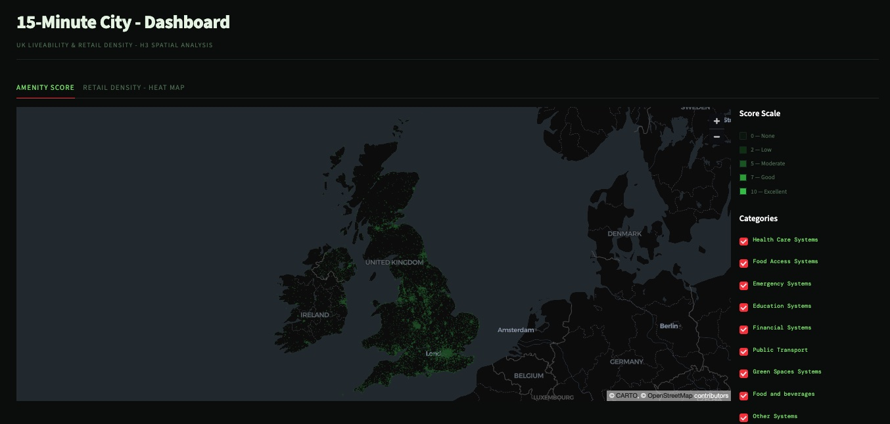
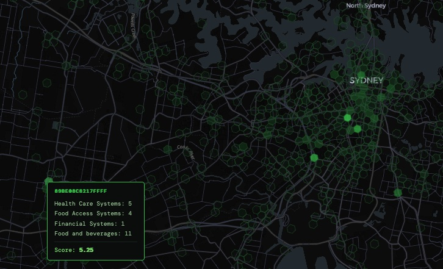
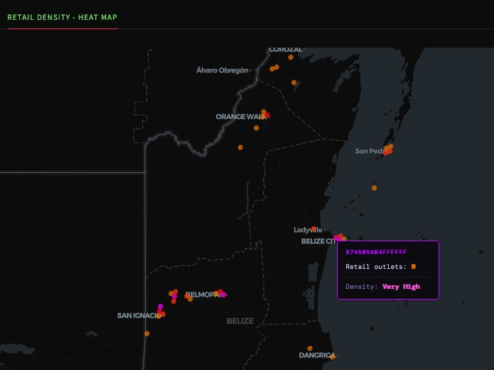

# 15-Minute City — OSM Liveability Pipeline

A end-to-end data engineering pipeline that scores neighbourhoods on walkable access to essential amenities, using raw OpenStreetMap data as the source of truth.

The pipeline downloads PBF extracts from Geofabrik, converts and projects them through DuckDB, transforms them with PySpark (H3 spatial indexing, opening hours parsing, liveability scoring), loads the results to BigQuery, runs a dbt transformation layer, and surfaces everything in a Streamlit dashboard with interactive H3 hex maps.

[Link to Streamlit Cloud dashboard](https://osmaps.streamlit.app/)

## Problem

The **15-minute city** is an urban planning concept with a simple premise: every resident should be able to reach their daily needs - healthcare, groceries, schools, green space, public transport all within a 15-minute walk or cycle from their home. It's a measurable standard for what makes a neighbourhood genuinely liveable, and it has real consequences: where people choose to live, how city budgets get allocated, and which communities are being underserved.

This project builds a fully automated data pipeline that:

1. **Ingests raw OpenStreetMap data** for entire countries — the most comprehensive and up-to-date open map dataset in existence, covering hospitals, schools, supermarkets, parks, bus stops, and hundreds of other amenity types.
2. **Scores every neighbourhood** by mapping each amenity to one of eight essential liveability categories (healthcare, food access, education, emergency services, green space, financial, transport, food & drink), each weighted by how critical it is to daily life.
3. **Indexes the results spatially** using Uber's H3 hexagonal grid at multiple resolutions, so scores can be compared consistently across neighbourhoods regardless of administrative boundaries.
4. **Surfaces the results interactively** in a dashboard where planners, researchers, or curious residents can explore liveability scores and retail density across countries at a glance.

## Stack

| Layer | Technology |
|---|---|
| Orchestration | Apache Airflow 3.x (standalone mode) |
| Ingestion | `osmium-tool`, DuckDB, `curl` |
| Transformation | PySpark 3.5.1, `h3`, `opening-hours-py` |
| Warehouse | Google BigQuery |
| dbt | `dbt-bigquery`, Astronomer Cosmos |
| Infrastructure | Terraform (GCS + BigQuery provisioning) |
| Dashboard | Streamlit, pydeck (`H3HexagonLayer`) |
| Runtime | Docker + Docker Compose |

## Repository Structure

```
osm/
├── airflow/
│   └── dags/
│       ├── osm_maps.py
│       └── helpers/
│           ├── fetch_url.py
│           ├── fetch_command.py
│           ├── dbt_configurations.py
│           └── load.py
│
├── dbt/
│   ├── dbt_project.yml
│   ├── profiles.yml
│   ├── packages.yml
│   └── models/
│       ├── staging/
│       │   ├── source.yml
│       │   └── stg_osm.sql
│       ├── intermediate/
│       │   └── int_osm.sql            # surrogate key, open hours split, dedup
│       └── marts/
│           ├── fct_amenity_score.sql  # pivoted liveability score per H3 res-9 cell
│           └── fct_retail_density.sql # shop count per H3 res-7 cell
│
├── spark/
│   ├── transform.py                   # UDF chain → Parquet output
│   └── helpers/
│       ├── utils.py                   # Coordinate parsing, H3 indexing, opening hours UDF
│       └── fetch_score.py             # Keyword-based liveability scorer (8 categories)
│
├── streamlit/
│   ├── app.py
│   ├── fallback/                      # Static snapshot for pre-pipeline use
│   │   ├── amenity_score.csv
│   │   └── retail_density.csv
│   └── helpers/
│       ├── load.py
│       ├── amenity_score.py
│       └── retail_density.py
│
├── terraform/
│   ├── main.tf
│   └── variables.tf
│
├── .env
├── Dockerfile
├── docker-compose.yml
└── up.sh                              # One-command bootstrap
```

## How It Works

### DAG: `osm_by_country`

```
get_countries()
    → download_and_clean_osm_maps.expand(country=countries)   ← one task per country
        → spark_job (SparkSubmitOperator)
            → load()
                → dbt (DbtTaskGroup via Cosmos)
                    → clean()
```

**1. Ingestion** — For each country in `COUNTRIES`, the pipeline fetches Geofabrik PBF URLs of each region in the coutry from a [public Gist](https://gist.github.com/mushroomsandchai/22fbbf4ec8c58f4eebd11cc994ea1750), then for each file runs:

```
curl → osmium export (points only, GeoJSONSeq) → DuckDB projection → Parquet
```

DuckDB projects only the 6 needed fields (`name`, `amenity`, `shop`, `leisure`, `opening_hours`, `coordinates`) at read time. The PBF and intermediate GeoJSONSeq are deleted immediately — only the lean Parquet survives.

**2. Spark Transform** — `transform.py` reads all country Parquets, filters to rows with at least one of `amenity`/`shop`/`leisure` set, then applies:

| UDF | What it does |
|---|---|
| `get_lat` / `get_lon` | Parses GeoJSON `[lon, lat]` coordinate string |
| `h3_res_9/8/7` | Indexes each point into H3 cells at three resolutions |
| `parse_opening_hours` | Normalises OSM opening hours → `"HH-HH"` numeric interval |
| `score_tag` | Keyword-matches amenity tag → liveability weight (0.1–1.0) |

**3. Liveability Scoring** — eight categories, each with a weight:

| Category | Weight |
|---|---|
| Healthcare | 1.0 |
| Food access | 0.9 |
| Emergency services | 0.7 |
| Education | 0.8 |
| Green spaces | 0.78 |
| Financial | 0.6 |
| Public transport | 0.75 |
| Food & drink | 0.2 |

**4. Load** — Spark output is loaded to BigQuery (`raw_osm`) via the Python client's `load_table_from_file` — direct streaming, no GCS staging step.

**5. dbt** — Three-layer transformation:

- `stg_osm` (view) — cast and rename
- `int_osm` (table) — surrogate key, open hours split, dedup via `QUALIFY`
- `fct_amenity_score` (table) — pivoted score per H3 res-9 cell
- `fct_retail_density` (table) — shop count per H3 res-7 cell

**6. Dashboard** — Streamlit serves two tabs: an amenity score map with per-category checkboxes and a retail density heat map. Both use pydeck `H3HexagonLayer` over a dark-matter CARTO basemap. The dashboard ships with fallback CSVs so it's usable before the first pipeline run.

## Setup

### Prerequisites

- Docker + Docker Compose
- Terraform
- A Google Cloud project with BigQuery and GCS APIs enabled
- A GCP service account JSON key with BigQuery Admin

### 1. Configure `.env`

```bash
# GCP credentials
LOCAL_GCS_JSON_CREDENTIALS_PATH=/absolute/path/to/your-key.json

# GCP project
PROJECT=your-gcp-project-id
DATASET=osm_liveability
PROJECT_LOCATION=US

# Countries to analyse — comma-separated Geofabrik slugs
# Full list: https://gist.github.com/mushroomsandchai/22fbbf4ec8c58f4eebd11cc994ea1750
COUNTRIES=united-kingdom,ireland-and-northern-ireland
```

### 2. Bootstrap

```bash
chmod +x up.sh
./up.sh
```

This will:
1. Run `terraform apply` to provision GCS and BigQuery
2. Create local directories with correct permissions
3. Start the Docker stack
4. Wait for Airflow to be ready and print credentials

### 3. Trigger the DAG

Visit `http://localhost:8080`, log in with the printed credentials, and trigger `osm_by_country`.

| Service | URL |
|---|---|
| Airflow | http://localhost:8080 |
| Streamlit | http://localhost:8501 |
| Spark Web UI | http://localhost:4040 |

## Dashboard

The Streamlit dashboard has two views:

**Amenity Score** — Each H3 res-9 hexagon (~0.1 km²) is coloured by its gross liveability score (weighted sum of amenity counts). Category checkboxes let you filter to specific systems. Hover for per-category breakdown and score.



**Retail Density** — Each H3 res-7 hexagon (~5 km²) is coloured by shop count on a log-normalised scale (yellow → red → purple). Hover for raw count and density label.



Both views fall back to bundled CSVs if BigQuery is unavailable.
